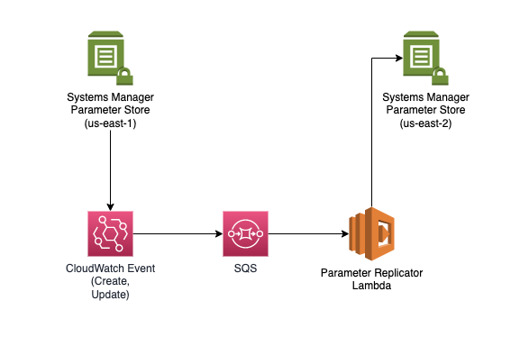

# Parameter-Store-CRR
Simple demo showing how to replicate parameter store items across regions for DR

# Prerequisites

## AWS Account

**Permissions**: In order to run the CFT, you'll need an AWS Account, and an AWS IAM user in that account with permissions to the following AWS services:

- AWS IAM
- EventBridge Rules
- SQS
- Amazon Lambda
- Systems Manager Parameter Store

**Use Your Own Account**: You may use a personal account to spin up the resources for this Demo.

**Costs**: There are likely no costs associated with this demo. These services fall within the free tier in a standard account.

# CFT Parameters

**DestinationRegion**: Target region should be where you want to copy your parameter store to

**KMSKey**: KMS Key for any Encrypted Parameters

# Application Logic

Any Update or Create event in the Systems Manager Parameter Store, event must be in the same region as the EventBridge rule or the region of the CFT, will store that event in the created SQS queue. Lambda will trigger automatically to initiate a PUT event to the desired Parameter Store Region.

1. Run CFT
2. Lambda auto-syncs all parameters to the new chosen region, ignoring existing parameters
3. Any additional updates to the parameter store will automatically trigger a sync using the Parameter Replicator Lambda
4. In order to auto-sync across both regions, just run this CFT in both regions

# Potential Bugs that I probably won't be fixing

1. Deleting the stack does not delete the parameters in the target region
2. When syncing the initial parameters to the new region, it does not sync the values of those parameters. It simply copies over the parameter if it does not yet exist (checking the parameter name)
3.
